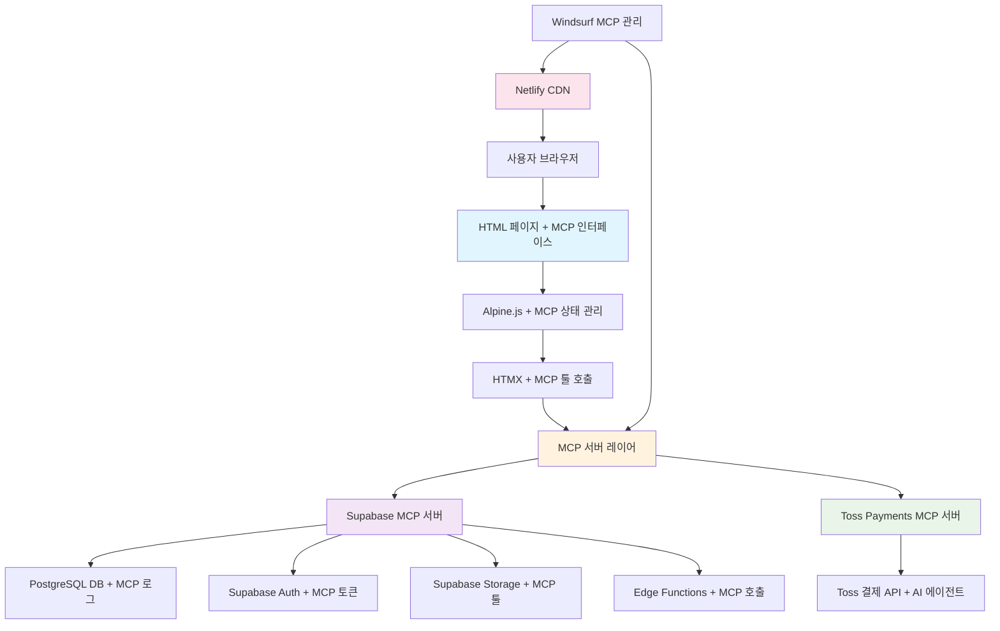

# 🏧️ IEPON MCP 시스템 아키텍처 및 공통 원칙

> **연결 문서**: [02_데이터베이스_설계.md](./02_데이터베이스_설계.md) | [07_API_설계.md](./07_API_설계.md) | [15_구현_페이지_리스트.md](./15_구현_페이지_리스트.md) | [08_환경_설정.md](./08_환경_설정.md) | [10_보안_권한.md](./10_보안_권한.md) | [14_결제_설계.md](./14_결제_설계.md)

> **MCP 통합 안내**: Model Context Protocol(MCP) 기반 서버 연돐 및 AI 에이전트 자동화 시스템

---

## 1.1 MCP 기반 새로운 기술 스택 (비전공자 친화적)

### Frontend (MCP 연돐 클라이언트 사이드)
- **마크업**: HTML5 (시맨틱 태그 기반) + MCP 툴 연돐 속성
- **스타일링**: 순수 CSS3 + 최소한의 Bootstrap 5 + MCP 서버 상태 스타일
- **상호작용**: Alpine.js 3.x (MCP 서버 상태 바인딩) + window.mcp 인터페이스
- **서버 통신**: HTMX 1.x (HTML 속성 기반 AJAX) + MCP 툴 호출 연돐
- **개발환경**: Windsurf AI 최적화 (자연어 코딩 + MCP 서버 관리)

### Backend (MCP 서버 사이드)
- **데이터베이스**: Supabase MCP PostgreSQL (관계형 DB + MCP 프로토콜)
- **인증시스템**: Supabase MCP Auth (JWT 기반 + MCP 토큰 검증)
- **결제 시스템**: Toss Payments MCP 서버 (AI 에이전트 기반 결제 자동화)
- **파일저장**: Supabase MCP Storage (클라우드 스토리지 + MCP 툴 연돐)
- **서버함수**: Supabase MCP Edge Functions (Deno 런타임 + MCP 호출)
- **실시간**: Supabase MCP Realtime (WebSocket + MCP 이벤트)

### 배포 및 운영
- **호스팅**: Netlify (정적 사이트 호스팅)
- **배포도구**: Windsurf AI 내장 배포 기능
- **모니터링**: Supabase 대시보드 + 브라우저 개발자도구
- **도메인**: iepon.site (공식 도메인)

---

## 1.2 반응형 디자인 원칙 (순수 CSS 기반)

### CSS 미디어 쿼리 브레이크포인트
```css
/* 모바일 우선 반응형 디자인 - 발달장애 학생 접근성 최우선 */
@media (min-width: 576px) {  /* 모바일 Large - 터치 영역 48px+ 확보 */}
@media (min-width: 768px) {  /* 태블릿 - 터치 기반 UI 최적화 */}
@media (min-width: 992px) {  /* 데스크톱 Small - 키보드 네비게이션 지원 */}
@media (min-width: 1200px) { /* 데스크톱 Large - 확대 기능 200% 지원 */}
@media (min-width: 1400px) { /* 초대형 데스크톱 - 고해상도 디스플레이 대응 */}

/* 접근성 우선 미디어 쿼리 */
@media (prefers-reduced-motion: reduce) { /* 애니메이션 감소 모드 */ }
@media (prefers-contrast: high) { /* 고대비 모드 */ }
@media (prefers-color-scheme: dark) { /* 다크 모드 */ }
```

### Bootstrap 5 활용 전략
```css
/* 필수 Bootstrap 컴포넌트만 선택적 사용 */
@import url('https://cdn.jsdelivr.net/npm/bootstrap@5.3.0/dist/css/bootstrap-grid.min.css'); /* 그리드만 */
@import url('https://cdn.jsdelivr.net/npm/bootstrap@5.3.0/dist/css/bootstrap-utilities.min.css'); /* 유틸리티만 */

/* 커스텀 CSS로 접근성 강화 */
.btn-accessible {
  min-height: 48px;     /* 터치 영역 확보 */
  min-width: 48px;      /* 터치 영역 확보 */
  font-size: 1.1rem;    /* 가독성 향상 */
  padding: 12px 20px;   /* 충분한 내부 여백 */
}
```

**Mobile First 접근법 (특수교육 접근성 강화)**
- 모든 HTML 요소는 모바일 화면부터 설계
- 터치 친화적 인터페이스 (최소 48px × 48px 터치 영역)
- 접근성(WCAG 2.1 AA) 100% 준수
- 고대비 색상 조합 사용 (4.5:1 이상 대비율)
- 스크린 리더 완전 지원 (aria-label, role 속성 필수)
- 키보드 네비게이션 100% 지원
- 텍스트 크기 조절 기능 (최대 200% 확대)
- 색상에 의존하지 않는 정보 전달

---

## 1.3 시스템 아키텍처 (단순화된 구조)

### MCP 기반 전체 시스템 흐름도


### 단순화된 3층 아키텍처

#### 1층: **MCP 연돐 사용자 인터페이스 (Frontend)**
```html
<!-- MCP 기반 HTML 구조 예시 -->
<!DOCTYPE html>
<html lang="ko">
<head>
  <meta charset="UTF-8">
  <meta name="viewport" content="width=device-width, initial-scale=1.0">
  <title>IEPON MCP - 학생 관리</title>
  <link rel="stylesheet" href="styles.css">
</head>
<body>
  <!-- MCP 서버 상태 표시 -->
  <div id="mcp-status" x-data="mcpStatus()" x-init="checkMcpServers()">
    <div x-show="!allServersHealthy" class="alert alert-warning">
      MCP 서버 연결 상태를 확인하는 중...
    </div>
  </div>
  
  <!-- Alpine.js + MCP 데이터 바인딩 -->
  <main x-data="studentManager()" x-init="loadStudentsViaMcp()">
    <h1>학생 목록 (MCP 연돐)</h1>
    
    <!-- HTMX + MCP 툴 호출 -->
    <div hx-get="/api/mcp/students" 
         hx-target="#student-list" 
         hx-trigger="load"
         hx-headers='{"X-MCP-Server": "supabase"}'>
      <ul id="student-list"></ul>
    </div>
    
    <!-- MCP 결제 컴포넌트 -->
    <div x-data="mcpPayment()" x-show="showPaymentOptions">
      <button @click="processPaymentViaMcp()" class="btn btn-primary">
        Toss MCP 결제 진행
      </button>
    </div>
  </main>
  
  <!-- CDN 라이브러리 + MCP 인터페이스 -->
  <script src="https://unpkg.com/alpinejs@3.x.x/dist/cdn.min.js" defer></script>
  <script src="https://unpkg.com/htmx.org@1.9.2"></script>
  <script src="/js/mcp-interface.js"></script> <!-- MCP 툴 인터페이스 -->
</body>
</html>
```

#### 2각층: **서버 로직 (Backend - Supabase)**
- **PostgreSQL 데이터베이스**: 학생, 교육과정, 진도 데이터 저장
- **Supabase Auth**: JWT 기반 사용자 인증 및 권한 관리
- **Row Level Security (RLS)**: 테이블 레벨 데이터 보안 정책
- **Supabase Realtime**: WebSocket 기반 실시간 데이터 동기화
- **Edge Functions**: Deno 런타임 서버리스 함수

#### 3각층: **배포 및 인프라 (Deployment)**
- **Netlify 호스팅**: 전 세계 CDN을 통한 빠른 정적 사이트 서빙
- **Windsurf AI 배포**: 원클릭 배포 도구 통합
- **도메인 관리**: iepon.site 공식 도메인 연결
- **SSL/HTTPS**: 자동 SSL 인증서 및 HTTPS 암호화

---

## 1.4 개발 원칙 (비전공자 친화적)

### 코드 품질 (단순성 우선)
- **HTML5 기반**: 시맨틱 태그로 구조화된 마크업
- **순수 CSS3**: 명확한 클래스명과 BEM 방법론 활용
- **단순 JavaScript**: ES6+ 문법, 단순한 함수 구조
- **Alpine.js 패턴**: 선언적 데이터 바인딩
- **HTMX 패턴**: HTML 속성 기반 서버 통신

### 성능 최적화 (가볍고 빠른 로딩)
- **이미지 최적화**: WebP 포맷 + 적절한 크기 조절
- **CSS 최소화**: 중요한 스타일 인라인 + 외부 CSS 최소화
- **JavaScript 지연 로딩**: 필수 기능만 초기 로드
- **캐싱 전략**: 브라우저 캐시 + Supabase 내장 캐싱

### 보안 (단순하지만 강력한 보안)
- **환경 변수 분리**: 민감 정보는 Netlify/Supabase 환경변수에서 관리
- **Supabase RLS**: 테이블별 데이터 접근 규칙 적용 (사용자별 권한 제어)
- **자동 HTTPS**: Netlify 자동 SSL 인증서 및 HTTPS 리다이렉트
- **JWT 인증**: Supabase Auth에서 자동 처리 (수동 설정 불필요)
- **개인정보 암호화**: Supabase 내장 암호화 기능 활용
- **입력 검증**: HTML5 내장 유효성 검사 + Alpine.js 클라이언트 검증
- **UTF-8 안전성**: 한글 데이터 입력 시 인코딩 검증 함수 사용

```javascript
// UTF-8 안전성 검증 함수 예시
function validateKoreanText(text) {
  try {
    const encoded = new TextEncoder().encode(text);
    const decoded = new TextDecoder('utf-8', { fatal: true }).decode(encoded);
    return decoded === text;
  } catch (error) {
    console.error('한글 인코딩 오류:', error);
    return false;
  }
}
```

---

## 1.5 개발 환경 (최소한의 도구만 사용)

### 필수 도구
```bash
# 기본적으로 브라우저만 있으면 개발 가능!
# 모든 필수 도구는 CDN으로 로드

# 선택적: 로컬 개발 서버 (간단한 테스트용)
python -m http.server 8000  # Python 3
# 또는
npx serve .  # Node.js가 있는 경우
```

### 추천 개발 환경
- **Windsurf AI**: AI 기반 자연어 코딩 환경 (최우선 추천)
- **VS Code**: 기본 텍스트 에디터 (대안)
- **필수 확장 없음**: HTML/CSS/JS는 기본 에디터로도 충분
- **브라우저 개발자도구**: 디버깅과 성능 모니터링에 최우선 활용

---

## 1.6 프로젝트 구조 (단순한 HTML 기반)

### 기본 프로젝트 구조
```
iepon-website/
├── index.html             # 메인 랜딩 페이지
├── pages/                 # 각 페이지 HTML 파일들
│   ├── auth/
│   │   ├── login.html      # 로그인 페이지
│   │   └── signup.html     # 회원가입 페이지
│   ├── dashboard/
│   │   ├── main.html       # 대시보드 메인
│   │   ├── students.html   # 학생 관리
│   │   ├── curriculum.html # 교육과정 관리
│   │   └── reports.html    # 보고서 생성
│   └── settings/
│       └── profile.html    # 프로필 설정
├── assets/                # 정적 리소스
│   ├── css/
│   │   ├── main.css        # 메인 스타일시트
│   │   ├── components.css  # 컴포넌트 스타일
│   │   └── responsive.css  # 반응형 스타일
│   ├── js/
│   │   ├── app.js          # Alpine.js 데이터 함수들
│   │   ├── supabase.js     # Supabase 연동 설정
│   │   └── utils.js        # 공돌 유틸리티 함수
│   └── images/            # 이미지 파일들
├── components/            # HTML 파썬 컴포넌트 (선택적)
│   ├── header.html      # 공통 헤더
│   ├── navigation.html  # 네비게이션 메뉴
│   └── footer.html      # 공통 푸터
└── _redirects             # Netlify 리다이렉트 설정
```

### 핸들링 전략
- **HTML 파일**: 각 페이지는 독립적인 HTML 파일로 작성
- **컴포넌트 재사용**: 공통 요소들은 HTML 파썬 또는 HTMX include로 처리
- **Alpine.js 데이터**: 각 페이지의 상태는 x-data 속성으로 관리
- **HTMX 통신**: 서버와의 데이터 교환은 HTML 속성로 처리

---

## 1.7 MCP 기반 상태 관리 전략 (Alpine.js + MCP 데이터 바인딩)

### Alpine.js + MCP 전역 상태 관리 패턴
```javascript
// MCP 기반 전역 상태 관리 - MCP 서버 상태 통합
document.addEventListener('alpine:init', () => {
  // MCP 연돐 전역 상태 저장소 (Alpine Store 활용)
  Alpine.store('app', {
    // 기본 상태
    user: null,              // 현재 로그인된 사용자
    students: [],            // 학생 목록
    loading: false,          // 로딩 상태
    error: null,             // 에러 메시지
    
    // MCP 서버 상태 관리
    mcpServers: {
      supabase: { status: 'unknown', lastCheck: null, healthy: false },
      toss_payments: { status: 'unknown', lastCheck: null, healthy: false }
    },
    mcpToolCalls: [],        // MCP 툴 호출 이력
    
    // 접근성 설정
    accessibility: {
      fontSize: 'medium',    // 'small', 'medium', 'large', 'extra-large'
      highContrast: false,   // 고대비 모드
      reducedMotion: false,  // 애니메이션 감소
      screenReader: false    // 스크린 리더 지원
    },
    
    // 사용자 액션
    setUser(user) {
      this.user = user;
      this.error = null;
    },
    
    // 학생 관리 액션
    addStudent(student) {
      this.students.push(student);
      this.error = null;
    },
    
    updateStudent(id, updates) {
      const index = this.students.findIndex(s => s.id === id);
      if (index !== -1) {
        this.students[index] = { ...this.students[index], ...updates };
      }
    },
    
    removeStudent(id) {
      this.students = this.students.filter(s => s.id !== id);
    },
    
    // 로딩 및 에러 처리
    setLoading(loading) {
      this.loading = loading;
    },
    
    setError(error) {
      this.error = error;
      this.loading = false;
    },
    
    clearError() {
      this.error = null;
    },
    
    // 접근성 설정 업데이트
    updateAccessibility(settings) {
      this.accessibility = { ...this.accessibility, ...settings };
      // localStorage에 사용자 설정 저장
      localStorage.setItem('iepon-accessibility', JSON.stringify(this.accessibility));
    },
    
    // 초기화 시 사용자 설정 복원
    loadAccessibilitySettings() {
      const saved = localStorage.getItem('iepon-accessibility');
      if (saved) {
        this.accessibility = { ...this.accessibility, ...JSON.parse(saved) };
      }
    }
  });
});
```

### HTMX + MCP 서버 데이터 통신 패턴
```javascript
// MCP 기반 서버 통신 및 에러 처리 - MCP 툴 호출 통합

// MCP 인터페이스 초기화
const mcpInterface = {
  // MCP 서버 상태 확인
  async checkServerHealth(serverName) {
    try {
      return await window.mcp.checkServerHealth(serverName);
    } catch (error) {
      console.error(`MCP 서버 ${serverName} 상태 확인 실패:`, error);
      return false;
    }
  },
  
  // MCP 툴 호출 래퍼
  async callTool(serverName, toolName, parameters = {}) {
    try {
      const result = await window.mcp.callTool(serverName, toolName, parameters);
      // 툴 호출 이력 저장
      Alpine.store('app').addMcpToolCall({
        serverName,
        toolName,
        parameters,
        result,
        timestamp: new Date().toISOString()
      });
      return result;
    } catch (error) {
      console.error(`MCP 툴 호출 실패 (${serverName}.${toolName}):`, error);
      throw error;
    }
  }
};

// Supabase MCP 클라이언트 설정
const supabaseMcp = {
  async query(table, options = {}) {
    return await mcpInterface.callTool('supabase', 'query', { table, ...options });
  },
  
  async insert(table, data) {
    return await mcpInterface.callTool('supabase', 'insert', { table, data });
  },
  
  async update(table, id, data) {
    return await mcpInterface.callTool('supabase', 'update', { table, id, data });
  },
  
  async delete(table, id) {
    return await mcpInterface.callTool('supabase', 'delete', { table, id });
  }
};

// HTMX 전역 설정
document.addEventListener('DOMContentLoaded', function() {
  // HTMX 요청 전 이벤트 (로딩 표시)
  document.body.addEventListener('htmx:beforeRequest', function(evt) {
    const loadingEl = document.querySelector('#loading-indicator');
    if (loadingEl) loadingEl.style.display = 'block';
  });
  
  // HTMX 요청 완료 이벤트 (로딩 숨김)
  document.body.addEventListener('htmx:afterRequest', function(evt) {
    const loadingEl = document.querySelector('#loading-indicator');
    if (loadingEl) loadingEl.style.display = 'none';
  });
  
  // HTMX 오류 처리 (한글 메시지)
  document.body.addEventListener('htmx:responseError', function(evt) {
    console.error('HTMX 요청 오류:', evt.detail);
    showErrorMessage('데이터를 가져오는 중 오류가 발생했습니다.');
  });
});

// 에러 메시지 표시 함수
function showErrorMessage(message) {
  const errorDiv = document.createElement('div');
  errorDiv.className = 'alert alert-danger';
  errorDiv.textContent = message;
  errorDiv.style.position = 'fixed';
  errorDiv.style.top = '20px';
  errorDiv.style.right = '20px';
  errorDiv.style.zIndex = '9999';
  
  document.body.appendChild(errorDiv);
  
  // 3초 후 자동 삭제
  setTimeout(() => {
    if (errorDiv.parentNode) {
      errorDiv.parentNode.removeChild(errorDiv);
    }
  }, 3000);
}

// UTF-8 인코딩 안전성 검증 함수
function validateKoreanInput(text) {
  try {
    // 한글 텍스트 인코딩 검증
    const encoded = new TextEncoder().encode(text);
    const decoded = new TextDecoder('utf-8', { fatal: true }).decode(encoded);
    return decoded === text;
  } catch (error) {
    console.error('한글 인코딩 오류:', error);
    return false;
  }
}

// Supabase 데이터 조회 래퍼 함수
async function fetchStudents() {
  try {
    const { data, error } = await supabase
      .from('students')
      .select('*')
      .order('created_at', { ascending: false });
      
    if (error) throw error;
    
    // 한글 데이터 안전성 검증
    const safeData = data.filter(student => {
      return student.name && validateKoreanInput(student.name);
    });
    
    return safeData;
  } catch (error) {
    console.error('학생 목록 조회 오류:', error);
    throw new Error('학생 목록을 불러올 수 없습니다.');
  }
}
```

---

## 📋 **체크리스트**

### 기본 개발 환경 (최소 설정)
- [ ] 브라우저 설치 (필수) - Chrome/Edge/Safari 최신버전
- [ ] Windsurf AI 계정 생성 및 로그인
- [ ] HTML/CSS/JS 테스트용 로컬 서버 (선택적)
- [ ] Supabase 계정 생성 및 API 키 발급

### Supabase 백엔드 설정
- [ ] Supabase 프로젝트 생성
- [ ] 데이터베이스 테이블 생성 ([02_데이터베이스_설계.md](./02_데이터베이스_설계.md) 참조)
- [ ] RLS(행 레벨 보안) 정책 적용
- [ ] 인증 설정 및 테스트

### Netlify 배포 설정
- [ ] Netlify 계정 생성
- [ ] 도메인 연결 (iepon.site)
- [ ] Windsurf AI로 원클릭 배포 테스트
- [ ] HTTPS 자동 설정 확인

---

## 🔗 **관련 문서**

- **[02_데이터베이스_설계.md](./02_데이터베이스_설계.md)**: Supabase PostgreSQL 데이터베이스 설계
- **[05_컴포넌트_설계.md](./05_컴포넌트_설계.md)**: HTML + Alpine.js 컴포넌트 설계
- **[06_상태_관리.md](./06_상태_관리.md)**: Alpine.js 데이터 바인딩 가이드
- **[07_API_설계.md](./07_API_설계.md)**: HTMX + Supabase API 통신 설계
- **[08_환경_설정.md](./08_환경_설정.md)**: Supabase 및 Netlify 환경 설정
- **[11_배포_가이드.md](./11_배포_가이드.md)**: Windsurf AI + Netlify 배포 가이드
- **[15_구현_페이지_리스트.md](./15_구현_페이지_리스트.md)**: 전체 HTML 페이지 구조 및 내비게이션
