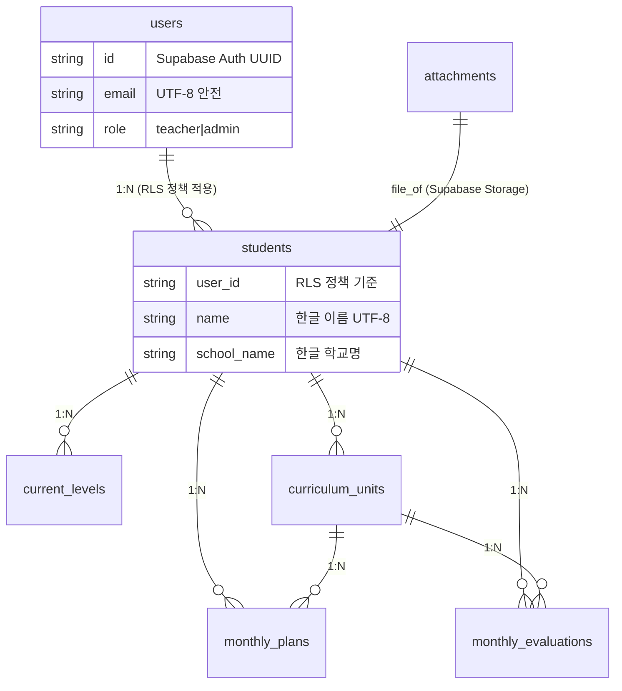
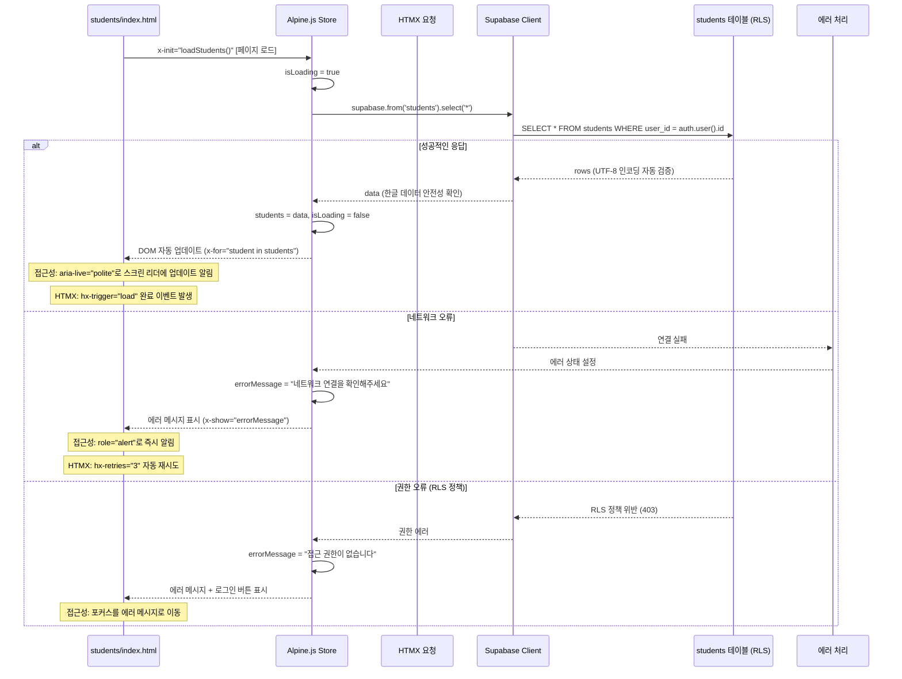
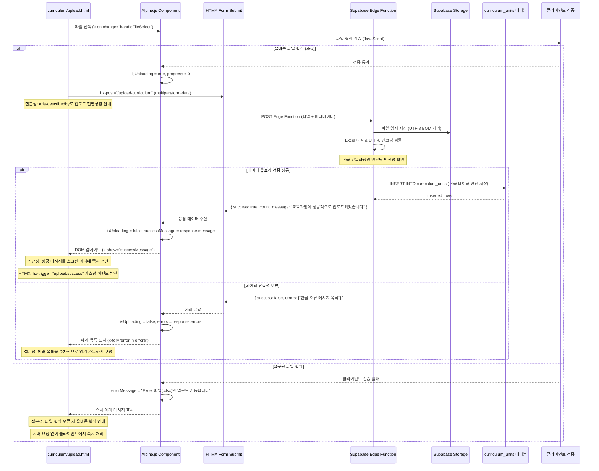
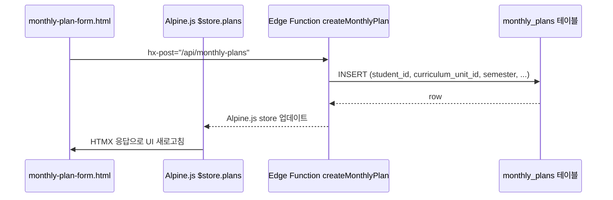
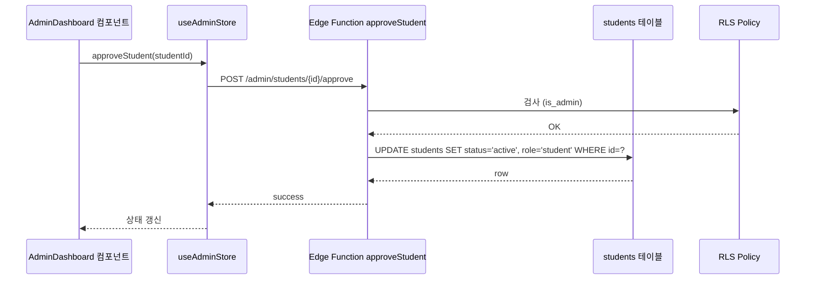
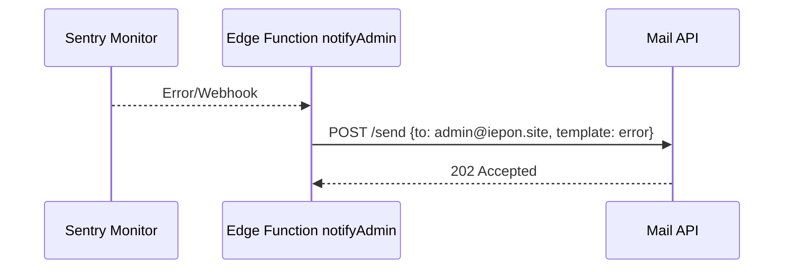
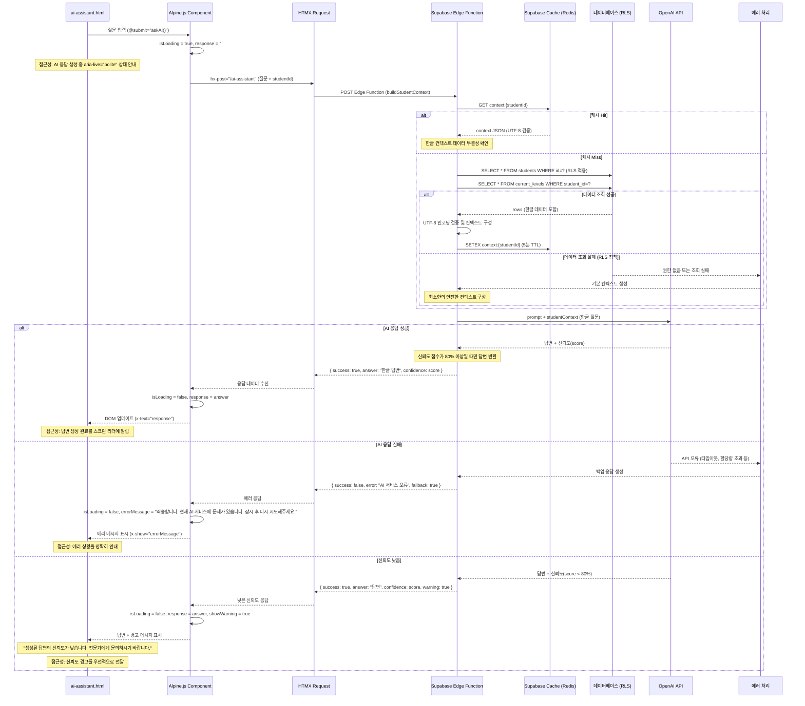

# 🗺️ IEPON 데이터 흐름 맵 (HTML + Alpine.js + HTMX + Supabase)

> **연결 문서**: [02_데이터베이스_설계.md](./02_데이터베이스_설계.md) | [05_컴포넌트_설계.md](./05_컴포넌트_설계.md) | [06_상태_관리.md](./06_상태_관리.md) | [07_API_설계.md](./07_API_설계.md)

> **🌟 새로운 아키텍처**: 이 문서는 HTML + Alpine.js + HTMX + Supabase 스택 기반의 단순화된 데이터 흐름을 설명합니다. 복잡한 상태 관리 라이브러리 없이 브라우저 네이티브 기능과 Alpine.js의 반응형 데이터를 활용한 직관적인 데이터 흐름을 제공합니다.

---

## 13.1 단순화된 ER 다이어그램 (Supabase PostgreSQL)

*공통 `status` ENUM*은 모든 테이블의 `status` 컬럼에서 참조하며, Supabase RLS(Row Level Security) 정책으로 데이터 접근을 제어합니다.

---

## 13.2 HTML + Alpine.js + HTMX 데이터 흐름 패턴

### 13.2.1 학생 목록 조회 (Alpine.js + HTMX 패턴)

### 13.2.2 교육과정 업로드 (Alpine.js + HTMX + Supabase Storage)

### 12.2.3 월간 계획 생성

---

## 12.3 Alpine.js Store ↔ HTMX 엔드포인트 ↔ Component 매핑

| 기능 영역 | HTMX 엔드포인트 | Alpine.js Store | HTML 컴포넌트 | 접근성 고려사항 |
|----------|----------------|-----------------|---------------|----------------|
| 학생 관리 | `hx-get="/api/students"` | `$store.students` | student-list.html, student-detail.html | 학생 목록 aria-label, 검색 결과 개수 안내 |
| 교육과정 | `hx-post="/api/curriculum"` / `hx-get="/api/curriculum-units"` | `$store.curriculum` | curriculum-upload.html, curriculum-list.html | 파일 업로드 진행률 aria-live, 에러 시 포커스 이동 |
| 월간계획 | `hx-get="/api/monthly-plans"` | `$store.plans` | monthly-plan-form.html, monthly-plan-table.html | 폼 유효성 검사 결과 즉시 알림, 저장 완료 상태 표시 |
| 월간평가 | `hx-get="/api/monthly-evaluations"` | `$store.evaluations` | monthly-evaluation-form.html | 평가 점수 변경 시 스크린 리더 안내, 고대비 색상 적용 |

> **데이터 흐름 규칙**
> - HTMX 엔드포인트는 `/api/[domain]` 패턴을 따르며, Alpine.js Store는 `$store.[domain]`로 통일
> - 모든 한글 데이터는 UTF-8 인코딩 검증 후 저장 및 조회
> - 에러 메시지는 사용자 친화적인 한글로 표시

---

## 12.4 실시간 데이터 동기화 패턴

1. **로그인 시** Supabase Auth → Alpine.js 사용자 정보 Store 초기화
   - 접근성: 로그인 완료 시 "안녕하세요, [사용자명]님" 스크린 리더 안내
   - UTF-8 안전성: 사용자명 한글 처리 시 인코딩 검증
   - 에러 처리: 토큰 만료 시 자동 갱신 또는 재로그인 유도

2. **각 페이지 진입 시** HTML 컴포넌트 → Alpine.js Store → HTMX로 데이터 fetch
   - 접근성: 데이터 로딩 중 aria-live="polite"로 상태 안내
   - UTF-8 안전성: 한글 데이터 수신 시 인코딩 무결성 자동 검증
   - 에러 처리: 네트워크 오류 시 "연결 상태를 확인해주세요" 한글 메시지 표시

3. **Mutate 계열** (업로드, 생성, 수정) Edge Function 성공 시 `queryClient.invalidateQueries()` 로 캐시 동기화
{{ ... }}
   - 에러 처리: 서버 오류 시 롤백 메커니즘 및 사용자 안내
   - 타입 안전성: 뮤테이션 데이터 타입 검증 및 스키마 일치성 확인

4. **실시간 변경** (Realtime) 발생 시 Supabase `on()` 리스너가 Store 상태 직접 업데이트
   - 접근성: 실시간 변경 사항을 "새로운 정보가 업데이트되었습니다" 알림으로 전달
   - 에러 처리: 실시간 연결 끊김 시 재연결 시도 및 상태 표시
   - 성능: 불필요한 리렌더링 방지를 위한 debounce 및 메모이제이션 적용

### 추가 고려사항
- **오프라인 모드**: 네트워크 연결 없을 때 로컬 캐시 데이터 활용
- **데이터 무결성**: 동시 편집 시 충돌 해결 및 마지막 수정자 우선 정책
- **성능 모니터링**: 데이터 로딩 시간 측정 및 3초 이상 시 진행률 표시

---

## 12.5 관리자 기능 흐름

### 12.5.1 학생 승인 및 권한 부여

### 12.5.2 관리자 알림 발송

---

## 13.6 AI 컨텍스트 생성 및 응답 흐름 (Alpine.js + Supabase Edge Functions)

> **AI 응답 실패 시 백업 플랜**: Supabase Edge Function에서 Cache fallback → DB 재조회 후 로컬 요약 알고리즘 실행.

---

## 13.7 HTML + Alpine.js + HTMX + Supabase 스택 검토 항목

### 🔒 보안 및 권한 관리 (Supabase RLS 기반)
- **RLS 정책 일관성**: [10_보안_권한.md]의 RLS 정책과 Edge Function 내부 권한 검증 일치성 확인
- **멀티테넌트 확장**: `user_id` 기반 RLS 정책을 모든 테이블에 일관성 있게 적용
- **교육 데이터 보호**: Supabase 암호화 저장 + 접근 로그 자동 관리 (audit 테이블)
- **클라이언트 보안**: Alpine.js에서 민감한 데이터 노출 방지 (API 키, 토큰 등)

### ♿ 접근성 및 사용성 (WCAG 2.1 AA 준수)
- **스크린 리더 호환성**: 모든 Alpine.js 데이터 바인딩에서 aria-live, role 속성 적용
- **키보드 네비게이션**: HTMX 로딩 중 포커스 관리 및 Alpine.js x-trap 활용
- **고대비 모드**: CSS 변수 기반 색상 시스템으로 4.5:1 이상 대비율 확보
- **에러 메시지 접근성**: Alpine.js x-show와 role="alert" 조합으로 즉시 알림
- **진행률 표시**: HTMX hx-indicator와 Alpine.js 진행률 바 연동

### 🌐 UTF-8 인코딩 안전성 (한글 데이터 처리)
- **클라이언트 검증**: Alpine.js에서 한글 입력 시 UTF-8 인코딩 검증 함수 적용
- **파일 업로드**: Supabase Storage 업로드 시 UTF-8 BOM 자동 처리
- **Edge Function**: 한글 데이터 처리 시 인코딩 무결성 자동 검증
- **데이터베이스**: PostgreSQL UTF-8 설정 및 한글 텍스트 저장 전 검증
- **HTMX 응답**: 서버 응답 헤더에 charset=utf-8 명시적 설정

### ⚡ 성능 및 확장성 (정적 HTML 기반)
- **브라우저 캐싱**: HTML/CSS/JS 파일 브라우저 캐시 최적화 (Cache-Control 헤더)
- **Supabase 캐싱**: Edge Function 응답 캐싱 및 Redis TTL 최적화
- **Alpine.js 성능**: 대용량 데이터 렌더링 시 x-for 가상화 적용
- **HTMX 최적화**: hx-boost 활용한 페이지 전환 성능 개선
- **이미지 최적화**: Supabase Storage 이미지 변환 API 활용

### 🛠️ 에러 처리 및 복구 (브라우저 네이티브)
- **네트워크 오류**: HTMX hx-retries와 Alpine.js 에러 상태 관리 연동
- **AI 서비스 장애**: Edge Function 백업 응답 + 클라이언트 fallback 메시지
- **데이터 동기화**: Alpine.js store 기반 낙관적 업데이트 + 실패 시 롤백
- **오프라인 지원**: Service Worker 기반 기본 캐싱 (선택사항)
- **에러 로깅**: Supabase Edge Function 에러 자동 로깅 시스템

### 🧪 테스트 및 모니터링 (브라우저 기반)
- **브라우저 테스트**: 개발자 도구 콘솔 기반 Alpine.js 컴포넌트 테스트
- **HTMX 테스트**: 네트워크 탭에서 요청/응답 검증
- **접근성 테스트**: axe-core 브라우저 확장 프로그램 활용
- **성능 모니터링**: Lighthouse 점수 기반 성능 측정
- **Supabase 모니터링**: 내장 대시보드 활용한 DB/Edge Function 모니터링

### 🔄 데이터 흐름 최적화
- **실시간 업데이트**: Supabase Realtime + Alpine.js 반응형 데이터 연동
- **배치 처리**: 대용량 데이터 처리 시 HTMX 청크 업로드 패턴
- **캐시 무효화**: Alpine.js store 기반 스마트 캐시 무효화 전략
- **상태 동기화**: 여러 탭 간 Alpine.js 상태 동기화 (BroadcastChannel API)

---

> **📋 참고**: 이 문서는 HTML + Alpine.js + HTMX + Supabase 스택 기반 개발자 온보딩용 **Single Source of Truth** 데이터 흐름 맵입니다. 변경 시 연결된 모든 문서([02_데이터베이스_설계.md](./02_데이터베이스_설계.md), [05_컴포넌트_설계.md](./05_컴포넌트_설계.md), [06_상태_관리.md](./06_상태_관리.md), [07_API_설계.md](./07_API_설계.md))를 함께 업데이트해야 일관성이 유지됩니다.
