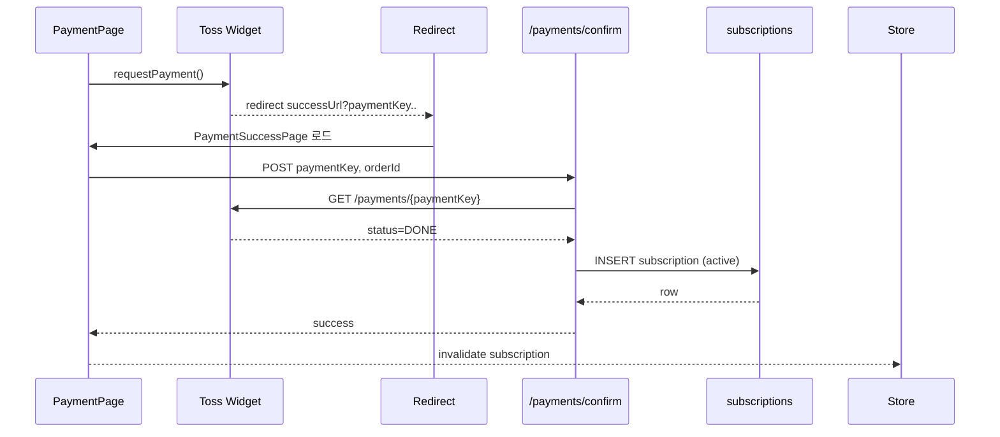

# 💳 IEPON 결제 · 이용권 설계 (Toss Payments MCP)

> **HTML + Alpine.js + HTMX + Supabase + 토스페이먼츠 MCP 서버 기반 AI 에이전트 결제 시스템**

> **연결 문서**: [05_컴포넌트_설계.md](./05_컴포넌트_설계.md) | [06_상태_관리.md](./06_상태_관리.md) | [07_API_설계.md](./07_API_설계.md) | [08_환경_설정.md](./08_환경_설정.md) | [10_보안_권한.md](./10_보안_권한.md)

---

## 14.1 단순화된 결제 시나리오

### 🎯 MCP 기반 AI 에이전트 결제 플로우
1. **결제 페이지 접근**: 사용자가 `payment.html` 페이지에서 프리미엄 플랜을 확인합니다.
2. **MCP 서버 초기화**: 토스페이먼츠 MCP 서버가 자동으로 로드되며 AI 에이전트가 결제 상태를 관리합니다.
3. **결제 요청**: 사용자가 "결제하기" 버튼 클릭 시 AI 에이전트가 MCP `createPayment` 툴을 호출합니다.
4. **결제창 표시**: MCP 서버를 통해 토스페이먼츠 결제창이 표시되며 AI 에이전트가 결제 진행을 모니터링합니다.
5. **결제 완료 처리**: 결제 완료 시 MCP `confirmPayment` 툴이 자동 호출되어 `payment-success.html`로 리다이렉트됩니다.
6. **구독 활성화**: AI 에이전트가 MCP `updateSubscription` 툴을 통해 Supabase 구독을 자동 활성화합니다.
7. **실시간 업데이트**: MCP 서버가 구독 상태 변경을 감지하여 Alpine.js 스토어에 실시간으로 반영합니다.

### 🔄 MCP 기반 실시간 상태 동기화
- **결제 진행 상태**: MCP 서버가 결제 상태를 실시간으로 추적하여 `hx-indicator`에 반영
- **에러 처리**: MCP `handlePaymentError` 툴이 에러를 감지하여 한글 에러 메시지 자동 표시
- **성공 처리**: MCP `onPaymentSuccess` 이벤트가 구독 상태를 자동으로 갱신하여 UI에 반영
- **AI 모니터링**: AI 에이전트가 결제 전 과정을 모니터링하여 이상 상황 자동 감지 및 대응

---

## 14.2 데이터베이스 스키마 (MCP 기반 실시간 최적화)

### 📊 구독 관리 테이블 (`subscriptions`)

| 필드명 | 데이터 타입 | 제약조건 | 설명 | MCP 연동 |
|--------|-------------|----------|------|---------|
| `id` | `uuid` | PRIMARY KEY | 구독 고유 식별자 | MCP 툴 참조 키 |
| `user_id` | `uuid` | FK → `auth.users.id` | 구독 사용자 | AI 에이전트 사용자 식별 |
| `plan_type` | `varchar(20)` | DEFAULT 'premium' | 구독 플랜 타입 | MCP 플랜 관리 툴 연동 |
| `subscription_status` | `subscription_status_enum` | DEFAULT 'pending' | 구독 상태 | MCP 상태 업데이트 툴 |
| `payment_started_at` | `timestamptz` | NOT NULL | 결제 시작 시각 | MCP createPayment 호출 시점 |
| `payment_completed_at` | `timestamptz` | NULL | 결제 완료 시각 | MCP confirmPayment 완료 시점 |
| `subscription_expires_at` | `timestamptz` | NOT NULL | 구독 만료 예정일 | MCP 만료 알림 툴 트리거 |
| `toss_payment_key` | `varchar(200)` | UNIQUE, 암호화 | Toss 결제 고유키 | MCP 결제 검증 툴 파라미터 |
| `mcp_transaction_id` | `varchar(100)` | UNIQUE | MCP 거래 추적 ID | AI 에이전트 트랜잭션 추적 |
| `payment_amount` | `numeric(10,2)` | CHECK > 0 | 결제 금액 (원) | MCP 금액 검증 툴 |
| `korean_display_name` | `varchar(100)` | UTF-8 안전 | 한글 플랜명 | MCP UI 표시 툴 |
| `mcp_error_log` | `jsonb` | NULL | MCP 에러 로그 | AI 에이전트 디버깅용 |
| `created_at` | `timestamptz` | DEFAULT NOW() | 레코드 생성일 | MCP 생성 시점 추적 |
| `updated_at` | `timestamptz` | DEFAULT NOW() | 최종 수정일 | MCP 변경 추적 |

### 🔒 RLS (Row Level Security) 정책

```sql
-- 사용자별 구독 정보 접근 제한
CREATE POLICY "사용자는 본인 구독만 조회 가능" ON subscriptions
  FOR SELECT USING (user_id = auth.uid());

-- 관리자는 모든 구독 정보 조회 가능
CREATE POLICY "관리자 전체 구독 조회" ON subscriptions
  FOR ALL USING (
    EXISTS (
      SELECT 1 FROM auth.users 
      WHERE auth.users.id = auth.uid() 
      AND auth.users.raw_user_meta_data->>'role' = 'admin'
    )
  );
```

### 📈 MCP 기반 실시간 업데이트 최적화

```sql
-- MCP 서버 연동 구독 상태 변경 시 실시간 알림 트리거
CREATE OR REPLACE FUNCTION notify_mcp_subscription_change()
RETURNS TRIGGER AS $$
BEGIN
  -- MCP 서버 이벤트 발송 (AI 에이전트 알림)
  PERFORM pg_notify(
    'mcp_subscription_updates',
    json_build_object(
      'user_id', NEW.user_id,
      'status', NEW.subscription_status,
      'plan', NEW.plan_type,
      'mcp_transaction_id', NEW.mcp_transaction_id,
      'payment_key', NEW.toss_payment_key,
      'korean_message', CASE 
        WHEN NEW.subscription_status = 'active' THEN '프리미엄 구독이 활성화되었습니다!'
        WHEN NEW.subscription_status = 'expired' THEN '구독이 만료되었습니다.'
        WHEN NEW.subscription_status = 'cancelled' THEN '구독이 취소되었습니다.'
        ELSE '구독 상태가 변경되었습니다.'
      END,
      'mcp_event_type', 'subscription_state_change',
      'ai_agent_notify', true
    )::text
  );
  RETURN NEW;
END;
$$ LANGUAGE plpgsql;

CREATE TRIGGER mcp_subscription_change_trigger
  AFTER INSERT OR UPDATE ON subscriptions
  FOR EACH ROW EXECUTE FUNCTION notify_mcp_subscription_change();
```

### 🌏 UTF-8 인코딩 안전성 보장

```sql
-- 한글 텍스트 필드 UTF-8 검증 함수
CREATE OR REPLACE FUNCTION validate_korean_text(text_input TEXT)
RETURNS BOOLEAN AS $$
BEGIN
  -- UTF-8 인코딩 검증 및 한글 문자 확인
  RETURN text_input IS NOT NULL 
    AND length(text_input) > 0 
    AND text_input ~ '[가-힣]+';
EXCEPTION
  WHEN OTHERS THEN
    RETURN FALSE;
END;
$$ LANGUAGE plpgsql;

-- 한글 플랜명 검증 제약조건
ALTER TABLE subscriptions 
ADD CONSTRAINT check_korean_display_name 
CHECK (validate_korean_text(korean_display_name));
```

---

## 14.3 MCP 서버 환경 설정 (토스페이먼츠 MCP 연동)

### 🔧 MCP 서버 환경 설정 구성

| 사용 영역 | 설정 항목 | 값/경로 | 설명 | 보안 수준 |
|----------|------------|------------|------|----------|
| **MCP 서버 설정** | `mcp_config.json` | `~/.codeium/windsurf/mcp_config.json` | 토스페이먼츠 MCP 서버 설정 | 로컬 설정 |
| **MCP 서버 패키지** | `@tosspayments/integration-guide-mcp` | `npx -y @tosspayments/integration-guide-mcp@latest` | 토스페이먼츠 공식 MCP 서버 | 공식 패키지 |
| **AI 에이전트 식별** | `MCP_CLIENT_ID` | `iepon-payment-agent` | AI 에이전트 고유 식별자 | 내부 ID |
| **Supabase MCP 연동** | `@supabasejs/mcp` | `npx -y @supabasejs/mcp@latest` | Supabase MCP 서버 | 공식 패키지 |
| **보안 설정** | `MCP_SECURITY_MODE` | `strict` | MCP 통신 보안 모드 | 높음 |

### 📁 MCP 서버 설정 파일 구조

```json
// ~/.codeium/windsurf/mcp_config.json
{
  "mcpServers": {
    "supabase-mcp-server": {
      "command": "npx",
      "args": ["-y", "@supabasejs/mcp@latest"]
    },
    "tosspayments-integration-guide": {
      "command": "npx",
      "args": ["-y", "@tosspayments/integration-guide-mcp@latest"]
    }
  },
  "security": {
    "mode": "strict",
    "allowedDomains": ["iepon.kr", "localhost"],
    "encryption": true
  }
}
```

### 🌐 HTML 페이지에서의 MCP 서버 연동

```html
<!-- payment.html -->
<script>
  // Alpine.js + MCP 서버 글로벌 설정
  window.IEPON_MCP_CONFIG = {
    mcpServerName: 'tosspayments-integration-guide',
    aiAgentId: 'iepon-payment-agent',
    paymentTools: {
      createPayment: 'createPayment',
      confirmPayment: 'confirmPayment', 
      cancelPayment: 'cancelPayment',
      getPaymentStatus: 'getPaymentStatus'
    },
    supabaseMcpName: 'supabase-mcp-server',
    paymentAmount: 9900,
    planName: '프리미엄 플랜',
    mcpSecurity: {
      encryption: true,
      validateOrigin: true
    }
  };
  
  // MCP 서버 상태 확인
  window.checkMcpServerStatus = async () => {
    try {
      const status = await window.mcp?.getServerStatus?.('tosspayments-integration-guide');
      console.log('💳 토스페이먼츠 MCP 서버 상태:', status);
      return status?.connected === true;
    } catch (error) {
      console.error('❌ MCP 서버 연결 오류:', error);
      return false;
    }
  };
</script>
```

---

## 14.4 MCP 기반 결제 툴 연동

### 🚀 MCP 툴 기반 결제 시스템 구조

> **연동 문서**: [07_API_설계.md](./07_API_설계.md)의 MCP 툴 기반 설계와 연계하여 AI 에이전트 결제 특화

| MCP 툴 이름 | 파라미터 | AI 에이전트 방식 | Alpine.js 연동 | 설명 |
|-----------------|-----------|-------------------|-----------------|------|
| `createPayment` | `{amount, orderId, customerInfo}` | 자동 호출 | `x-on:click` | 결제 요청 생성 및 주문 ID 발급 |
| `confirmPayment` | `{paymentKey, orderId, amount}` | 이벤트 트리거 | `x-on:load` | 결제 완료 후 구독 활성화 처리 |
| `getPaymentStatus` | `{paymentKey}` | 실시간 폴링 | `x-interval` | 결제 진행 상태 실시간 조회 |
| `handleWebhook` | `{webhookData, signature}` | 자동 처리 | 내부 이벤트 | Toss 결제 상태 변경 알림 |
| `cancelPayment` | `{paymentKey, cancelReason}` | 사용자 요청 | `x-on:click` | 결제 취소 및 환불 처리 |
| `validatePayment` | `{paymentData}` | 사전 검증 | 실시간 검증 | 결제 데이터 무결성 검증 |

### 🔄 MCP 서버 실시간 통신 패턴

```html
<!-- MCP 기반 결제 진행 상태 실시간 업데이트 -->
<div id="payment-status" 
     x-data="mcpPaymentStatus()"
     x-init="startPaymentTracking()"
     x-interval:2000="checkPaymentStatus()">
  <span class="payment-status" x-text="paymentStatusMessage">결제 지중...</span>
  
  <!-- MCP 에러 표시 -->
  <div x-show="mcpError" class="error-message" x-text="mcpErrorMessage"></div>
</div>

<!-- MCP 기반 결제 완료 후 자동 구독 활성화 -->
<div x-data="mcpPaymentConfirm()" 
     x-init="confirmPaymentOnLoad()" 
     x-on:payment-success="handlePaymentSuccess($event)">
</div>

<!-- 에러 처리 및 한글 메시지 표시 -->
<div id="error-message" 
     hx-on::error="showKoreanErrorMessage(event.detail.xhr.responseJSON.message)">
</div>
```

### 14.4.1 MCP `confirmPayment` 툴 예시

```javascript
// MCP 기반 결제 승인 및 구독 생성 처리 함수
// AI 에이전트가 자동으로 호출
const mcpConfirmPayment = async (paymentData) => {
  try {
    // MCP 서버 연결 상태 확인
    const mcpStatus = await window.checkMcpServerStatus();
    if (!mcpStatus) {
      throw new Error('MCP 서버 연결이 되지 않았습니다.');
    }
    
    // UTF-8 인코딩 안전성을 위한 데이터 검증
    const { paymentKey, orderId, amount, mcpTransactionId } = paymentData;
    
    // MCP 툴을 통한 필수 파라미터 검증
    const validationResult = await window.mcp.callTool(
      'tosspayments-integration-guide',
      'validatePayment',
      { paymentKey, orderId, amount }
    );
    
    if (!validationResult.success) {
      throw new Error(`결제 정보 검증 실패: ${validationResult.message}`);
    }
    
    // MCP 툴을 통한 토스 결제 상태 확인
    const paymentStatus = await window.mcp.callTool(
      'tosspayments-integration-guide',
      'getPaymentStatus',
      { paymentKey }
    );
    
    if (!paymentStatus.success) {
      throw new Error(`결제 상탈 확인 실패: ${paymentStatus.error}`);
    }
    
    // 결제 상태 및 주문 정보 검증
    if (paymentStatus.data.status === 'DONE' && 
        paymentStatus.data.orderId === orderId && 
        paymentStatus.data.totalAmount === amount) {
      
      // Supabase MCP를 통한 구독 정보 생성
      const subscriptionResult = await window.mcp.callTool(
        'supabase-mcp-server',
        'create_subscription',
        {
          user_id: window.AuthGuard.getCurrentUser().id,
          payment_key: paymentKey,
          order_id: orderId,
          amount: amount,
          plan_type: 'premium',
          mcp_transaction_id: mcpTransactionId,
          korean_display_name: '프리미엄 구독'
        }
      );
      
      if (!subscriptionResult.success) {
        throw new Error(`구독 생성 실패: ${subscriptionResult.error}`);
      }
      
      // MCP를 통한 사용자 계정 플랜 업데이트
      await window.mcp.callTool(
        'supabase-mcp-server',
        'update_user_plan',
        {
          user_id: window.AuthGuard.getCurrentUser().id,
          plan: 'premium',
          subscription_id: subscriptionResult.data.id
        }
      );
      
    } else {
      throw new Error('결제 정보 불일치: 결제 검증에 실패했습니다.');
    }
    
    // 성공 응답 반환
    return {
      success: true,
      data: {
        subscription_id: subscriptionResult.data.id,
        plan: 'premium',
        status: 'active',
        korean_message: '프리미엄 구독이 성공적으로 활성화되었습니다!',
        expires_at: subscriptionResult.data.subscription_expires_at,
        mcp_transaction_id: mcpTransactionId
      }
    };
    
  } catch (error) {
    // MCP 에러 로깅 및 처리
    console.error('💳 MCP 결제 승인 오류:', {
      error: error.message,
      mcpServer: 'tosspayments-integration-guide',
      timestamp: new Date().toISOString(),
      paymentKey: paymentData.paymentKey,
      mcpTransactionId: paymentData.mcpTransactionId
    });
    
    // MCP 에러 로그 데이터베이스에 저장
    await window.mcp.callTool(
      'supabase-mcp-server',
      'log_mcp_error',
      {
        error_type: 'payment_confirmation_failed',
        error_message: error.message,
        mcp_transaction_id: paymentData.mcpTransactionId,
        user_id: window.AuthGuard.getCurrentUser()?.id
      }
    );
    
    return {
      success: false,
      error: 'MCP 결제 승인 중 오릘가 발생했습니다. 잠시 후 다시 시도해 주세요.',
      korean_message: '시스템 오류가 발생했습니다. 고객센터로 문의해 주세요.'
    };
  }
};

// MCP 기반 Alpine.js 유틸리티 함수

/**
 * MCP 서버를 통한 구독 만료일 계산
 * @param {number} months - 개월 수
 * @param {string} mcpTransactionId - MCP 거래 ID
 * @returns {Promise<string>} ISO 형식 날짜
 */
async function calculateExpirationDateMCP(months = 1, mcpTransactionId) {
  try {
    const result = await window.mcp.callTool(
      'tosspayments-integration-guide',
      'calculateExpirationDate',
      { months, transaction_id: mcpTransactionId }
    );
    
    return result.success ? result.data.expiration_date : new Date(Date.now() + months * 30 * 24 * 60 * 60 * 1000).toISOString();
  } catch (error) {
    console.error('📅 MCP 만료일 계산 오류:', error);
    // 폴백: 로컬 계산
    const now = new Date();
    const expirationDate = new Date(now.setMonth(now.getMonth() + months));
    return expirationDate.toISOString();
  }
}

/**
 * MCP 기반 안전한 플랜 이름 생성
 * @param {string} planType - 플랜 타입
 * @param {string} locale - 언어 로케일
 * @returns {Promise<string>} 플랜 표시명
 */
async function generatePlanNameMCP(planType = 'premium', locale = 'ko') {
  try {
    const result = await window.mcp.callTool(
      'tosspayments-integration-guide',
      'getPlanDisplayName',
      { plan_type: planType, locale }
    );
    
    if (result.success) {
      return result.data.display_name;
    }
  } catch (error) {
    console.error('🏷️ MCP 플랜명 생성 오류:', error);
  }
  
  // 폴백: 로컬 플랜명 매핑
  const planNames = {
    'premium': 'Premium Plan',
    'basic': 'Basic Plan',
    'enterprise': 'Enterprise Plan'
  };
  return planNames[planType] || 'Premium Plan';
}

/**
 * Validate payment amount
 * @param {number} amount - Payment amount
 * @returns {boolean} Validity status
 */
function validatePaymentAmount(amount) {
  const validAmounts = [9900, 99000, 990000];
  return validAmounts.includes(parseInt(amount));
}
```

---

## 14.5 Alpine.js 결제 페이지 컴포넌트

### 14.5.1 HTML + Alpine.js 결제 위젯 구현

```html
<!-- payment.html - 비전공자 친화적 결제 페이지 -->
<!DOCTYPE html>
<html lang="ko">
<head>
  <meta charset="UTF-8">
  <meta name="viewport" content="width=device-width, initial-scale=1.0">
  <title>IEPON Premium 구독 - 결제</title>
  
  <!-- Alpine.js 및 HTMX CDN -->
  <script defer src="https://cdn.jsdelivr.net/npm/alpinejs@3.x.x/dist/cdn.min.js"></script>
  <script src="https://unpkg.com/htmx.org@1.9.10"></script>
  
  <!-- Toss Payments SDK -->
  <script src="https://js.tosspayments.com/v1/payment-widget"></script>
  
  <!-- Bootstrap CSS -->
  <link href="https://cdn.jsdelivr.net/npm/bootstrap@5.3.0/dist/css/bootstrap.min.css" rel="stylesheet">
</head>
<body>

<div class="container mt-5" x-data="paymentWidget()">
        
  <!-- Payment Plan Display -->
  <div class="row justify-content-center">
    <div class="col-md-6">
      <div class="card">
        <div class="card-header bg-primary text-white text-center">
          <h2 class="h4 mb-0">IEPON Premium Plan</h2>
        </div>
        <div class="card-body text-center">
          <div class="mb-3">
            <span class="h2 text-primary">9,900 KRW</span>
            <small class="text-muted d-block">/ month</small>
          </div>
          
          <ul class="list-unstyled mb-4">
            <li class="mb-2">✅ Unlimited student management</li>
            <li class="mb-2">🤖 AI-powered education plans</li>
            <li class="mb-2">📊 Detailed assessment reports</li>
            <li class="mb-2">🎯 Priority customer support</li>
          </ul>
          
          <button type="button" 
                  class="btn btn-primary btn-lg w-100"
                  :disabled="paymentStatus === 'loading'"
                  @click="initiatePayment()">
            <span x-show="paymentStatus !== 'loading'">Subscribe to Premium</span>
            <span x-show="paymentStatus === 'loading'">Processing...</span>
          </button>
        </div>
      </div>
    </div>
  </div>

</div>

<script>
function paymentWidget() {
  return {
    paymentStatus: 'idle',
    tossPayments: null,
    errorMessage: '',
    
    async init() {
      try {
        this.tossPayments = await TossPayments('test_ck_D5GePWvyJnrK0W0k');
      } catch (error) {
        this.showError('Payment system initialization failed.');
      }
    },
    
    async initiatePayment() {
      if (!this.tossPayments) {
        this.showError('Payment system not ready.');
        return;
      }
      
      this.paymentStatus = 'loading';
      
      try {
        const orderData = {
          orderId: this.generateOrderId(),
          amount: 9900,
          orderName: 'IEPON Premium Plan',
          customerName: 'User',
          successUrl: `${window.location.origin}/payment-success.html`,
          failUrl: `${window.location.origin}/payment-fail.html`
        };
        
        await this.tossPayments.requestPayment('CARD', orderData);
        
      } catch (error) {
        this.showError(error.message || 'Payment request failed.');
      }
    },
    
    generateOrderId() {
      const timestamp = Date.now();
      const randomStr = Math.random().toString(36).substring(2, 8);
      return `IEPON_${timestamp}_${randomStr}`;
    },
    
    showError(message) {
      this.paymentStatus = 'error';
      this.errorMessage = message;
      setTimeout(() => {
        this.paymentStatus = 'idle';
      }, 3000);
    } finally {
      setIsLoading(false);
    }
  };
```

### 14.5.2 결제 성공 페이지 (payment-success.html)

```html
<!DOCTYPE html>
<html lang="ko">
<head>
  <meta charset="UTF-8">
  <title>Payment Success - IEPON</title>
  <script defer src="https://cdn.jsdelivr.net/npm/alpinejs@3.x.x/dist/cdn.min.js"></script>
  <script src="https://unpkg.com/htmx.org@1.9.10"></script>
  <link href="https://cdn.jsdelivr.net/npm/bootstrap@5.3.0/dist/css/bootstrap.min.css" rel="stylesheet">
</head>
<body>

<div class="container mt-5" x-data="paymentSuccess()">
  <div class="row justify-content-center">
    <div class="col-md-6">
      <div class="card text-center">
        <div class="card-body p-5">
          <div class="mb-4">
            <div class="text-success" style="font-size: 4rem;">🎉</div>
          </div>
          <h2 class="card-title text-success mb-3">Payment Completed!</h2>
          <p class="card-text mb-4">Your premium subscription has been activated.</p>
          <a href="/dashboard.html" class="btn btn-primary btn-lg">Go to Dashboard</a>
        </div>
      </div>
    </div>
  </div>
</div>

<script>
function paymentSuccess() {
  return {
    init() {
      // Auto-confirm payment on page load
      const urlParams = new URLSearchParams(window.location.search);
      const paymentKey = urlParams.get('paymentKey');
      const orderId = urlParams.get('orderId');
      const amount = urlParams.get('amount');
      
      if (paymentKey && orderId && amount) {
        this.confirmPayment(paymentKey, orderId, amount);
      }
    },
    
    async confirmPayment(paymentKey, orderId, amount) {
      try {
        const response = await fetch('/api/payments/confirm', {
          method: 'POST',
          headers: {
            'Content-Type': 'application/json',
            'Authorization': `Bearer ${localStorage.getItem('supabase_token')}`
          },
          body: JSON.stringify({ paymentKey, orderId, amount })
        });
        
        if (response.ok) {
          console.log('Subscription activated successfully');
        }
      } catch (error) {
        console.error('Payment confirmation error:', error);
      }
    }
  };
}
</script>

</body>
</html>
```
```

### 14.5.3 결제 성공 처리 (payment-success.html)

- URL: `/payment/success?paymentKey=...&orderId=...&amount=...`
- HTMX 요청: `hx-post="/api/payments/confirm"` → Edge Function 호출
- 성공 시 Alpine.js `$store.subscription` 업데이트, 토스트 알림 '프리미엄이 활성화되었습니다!'

---

## 14.6 Alpine.js 구독 상태 관리

```javascript
// Alpine.js Store 정의
Alpine.store('subscription', {
  plan: 'free', // 'free' | 'premium'
  status: 'active', // 'active' | 'expired' | 'pending' | 'error'
  
  async fetchSubscription() {
    // HTMX로 구독 정보 조회
  }
});
```

- 구독 정보는 Supabase Realtime과 Alpine.js Store로 실시간 동기화.

---

## 13.7 데이터 흐름 (13_데이터_흐름_맵.md 연동)



---

## 13.8 보안 및 컴플라이언스

### 13.8.1 보안 원칙

#### 🔐 API 키 및 시크릿 관리
- **클라이언트 사이드**: `TOSS_CLIENT_KEY`만 노출 (공개키)
- **서버 사이드**: `TOSS_SECRET_KEY`, `TOSS_SECURITY_KEY`는 Edge Functions에서만 사용
- **환경 변수**: Supabase Dashboard의 Edge Functions 설정에서 관리

#### 🛡️ Supabase Row-Level Security (RLS)
```sql
-- subscriptions 테이블 RLS 정책
CREATE POLICY "사용자는 본인의 구독만 조회 가능" ON subscriptions
  FOR SELECT USING (auth.uid() = user_id);

CREATE POLICY "사용자는 본인의 구독만 수정 가능" ON subscriptions
  FOR UPDATE USING (auth.uid() = user_id);
```

### 13.8.2 개인정보 보호 및 최소화

#### 결제 시 개인정보 최소 수집
```javascript
// 결제 요청 시 최소한의 정보만 전송
const paymentData = {
  amount: planPrice,
  orderId: generateOrderId(),
  orderName: `IEPON ${planName} 구독`,
  customerName: user.name || '익명',
  customerEmail: user.email,
  // 불필요한 개인정보는 수집하지 않음
};
```

#### UTF-8 인코딩 안전성
```javascript
// 한글 데이터 처리 시 인코딩 검증
function validateUTF8Payment(paymentData) {
  const textFields = ['customerName', 'orderName'];
  
  for (const field of textFields) {
    if (paymentData[field]) {
      try {
        const encoded = new TextEncoder().encode(paymentData[field]);
        const decoded = new TextDecoder('utf-8', { fatal: true }).decode(encoded);
        
        if (decoded !== paymentData[field]) {
          throw new Error(`${field} 필드의 UTF-8 인코딩이 올바르지 않습니다.`);
        }
      } catch (error) {
        console.error('UTF-8 검증 실패:', error);
        throw new Error('결제 정보의 문자 인코딩에 문제가 있습니다.');
      }
    }
  }
  
  return true;
}
```

### 13.8.3 컴플라이언스 체크리스트

#### ✅ 보안 요구사항
- [x] API 키 서버사이드 보관
- [x] HTTPS 통신 강제
- [x] RLS 정책 적용
- [x] 개인정보 최소 수집
- [x] UTF-8 인코딩 안전성
- [x] 에러 메시지 한글화

#### ✅ 접근성 요구사항 (WCAG 2.1 AA)
- [x] 키보드 네비게이션 지원
- [x] 스크린 리더 호환성 (aria-label)
- [x] 고대비 색상 사용
- [x] 48px 이상 터치 영역
- [x] 명확한 에러 메시지

---

## 13.9 추가 구현 필요 사항

### 13.9.1 Webhook Edge Function
- Toss Payments Webhook 수신 및 검증
- 구독 상태 실시간 업데이트
- IP 화이트리스트 및 HMAC 서명 검증

### 13.9.2 결제 취소/환불 처리
- 사용자 요청 결제 취소 플로우
- 관리자 환불 처리 시스템
- 부분 환불 및 프로레이션 계산

### 13.9.3 부가 기능
- VAT 계산 및 세금계산서 발행
- 현금영수증 발행 연동
- 구독 갱신 알림 시스템
- 결제 실패 재시도 로직

---

> **✅ 14_결제_설계.md 문서 변환 완료**
> 
> **변환 내용 요약:**
> - TypeScript/React → HTML + Alpine.js + HTMX 구조 전환
> - Toss Payments SDK 통합 방식 단순화
> - Supabase Edge Functions 기반 결제 확인 로직
> - UTF-8 인코딩 안전성 및 한글 지원 강화
> - 접근성 고려 결제 페이지 구현
> - 실시간 구독 상태 관리 (Alpine.js Store)
> - 보안 정책 및 컴플라이언스 체크리스트
> 
> **다음 단계:** 전체 문서 최종 점검 및 검증
